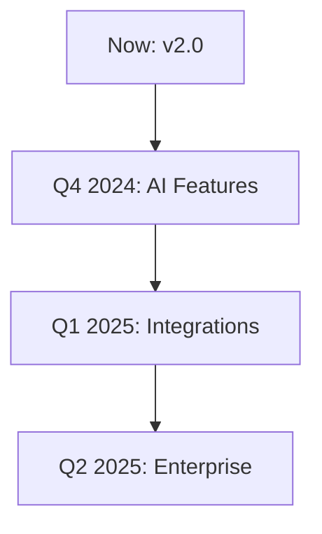

## Recent Updates

Stay informed about the latest changes in Mar Key. You can find detailed release notes for each version below, including new features, improvements, bug fixes, and any breaking changes.

<Update label="2024-11-05" description="v2.0.0" tags={["feature", "breaking"]}>

## New Features

- Added real-time document collaboration, allowing multiple users to edit simultaneously with live cursors and conflict resolution.
- Introduced webhook support for custom integrations with `https://your-webhook-url.com/webhook`.

## Improvements

- Enhanced search functionality with fuzzy matching and full-text indexing for faster results.

## Bug Fixes

- Fixed authentication token refresh issues during long sessions.
- Resolved export errors when handling large documents (>50MB).

## Breaking Changes

Update your API calls to use the new endpoint structure:

<CodeGroup tabs="JavaScript,Python">
```javascript
// Old
const response = await fetch('https://api.example.com/v1/docs');

// New
const response = await fetch('https://api.example.com/v2/documents');
```
```python
# Old
response = requests.get('https://api.example.com/v1/docs')

# New
response = requests.get('https://api.example.com/v2/documents')
```
</CodeGroup>

</Update>

<Update label="2024-10-15" description="v1.5.0" tags={["feature", "improvement"]}>

## New Features

- Dashboard analytics with usage metrics and exportable reports.
- Custom templates for recurring document types.

## Improvements

- Optimized performance for documents with >1000 pages, reducing load time by 40%.
- Better mobile responsiveness in the editor interface.

## Bug Fixes

- Corrected permission errors in shared folders.
- Fixed keyboard shortcuts conflicting with browser defaults.

</Update>

<Update label="2024-09-20" description="v1.0.0" tags={["feature"]}>

## Initial Release

- Core document editor with rich text formatting and version history.
- User authentication via API keys and OAuth.
- Basic API endpoints for CRUD operations on documents.

## Getting Started

Set up your first project:

<Steps>
<Step title="Create Account" icon="user-plus">

Visit `https://dashboard.example.com` and sign up.

</Step>
<Step title="Generate API Key" icon="key">

Navigate to settings and create a new `{API_KEY}`.

</Step>
<Step title="Install SDK" icon="download">

```bash
npm install @markey/sdk
```

</Step>
</Steps>

</Update>

## Upcoming Roadmap

Discover what's coming next to Mar Key. These features are in active development.

<Columns cols={3}>
<Card title="AI-Powered Editing" icon="zap" href="#ai-editing">
  Smart suggestions and auto-complete for faster writing.
</Card>
<Card title="Advanced Integrations" icon="plug" href="#integrations">
  Native support for Slack, GitHub, and Zapier.
</Card>
<Card title="Enterprise Features" icon="shield" href="#enterprise">
  SSO, audit logs, and compliance tools.
</Card>
</Columns>



<Callout kind="tip">
Subscribe to our newsletter at `https://docs.example.com/newsletter` to get notified about new releases.
</Callout>

## How to Upgrade

Follow these steps to update to the latest version:

<Steps>
<Step title="Backup Data" icon="database">
  Export all documents via the dashboard.
</Step>
<Step title="Update SDK" icon="package">
  Run the upgrade command:
  ```bash
  npm update @markey/sdk
  ```
</Step>
<Step title="Test Integrations" icon="test-tube">
  Verify your webhooks and API calls work with the new endpoints.
</Step>
</Steps>

<Callout kind="alert">
Review breaking changes in v2.0.0 before upgrading production environments.
</Callout>