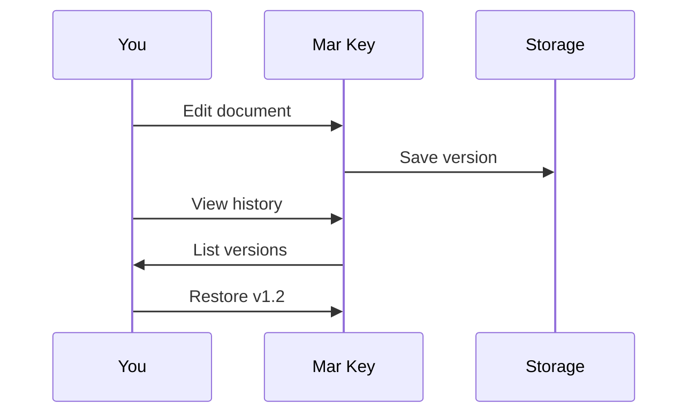

## Overview

Mar Key provides powerful tools to organize, collaborate on, and maintain your documentation efficiently. You structure content with intuitive folders, invite team members for real-time collaboration, track every change with version history, and find information quickly using advanced search features.

<Columns cols={2}>
  <Card title="Document Structuring" icon="folder" href="#document-structuring">
    Organize docs hierarchically with folders and subfolders.
  </Card>
  <Card title="Collaboration" icon="users" href="#collaboration">
    Share docs securely with teams and external collaborators.
  </Card>
  <Card title="Version History" icon="git-branch" href="#version-history">
    Track changes and revert to previous versions easily.
  </Card>
  <Card title="Search Tools" icon="search" href="#search-tools">
    Filter and locate content across your entire workspace.
  </Card>
</Columns>

## Document Structuring and Folders

You create a clear hierarchy in Mar Key using folders to group related documentation. Start by creating a root folder for your project, then nest subfolders for sections like API references, guides, and FAQs.

<Steps>
  <Step title="Create Folder" icon="folder-plus">
    Navigate to your workspace root. Click the `{New Folder}` button and name it `API Docs`.
  </Step>
  <Step title="Add Subfolders" icon="folder">
    Inside `API Docs`, create subfolders: `Endpoints`, `Authentication`, and `Examples`.
  </Step>
  <Step title="Upload Files" icon="upload">
    Drag MDX files into the appropriate folders. Mar Key auto-generates navigation.
  </Step>
</Steps>

View your structure:

````bash
project/
├── API Docs/
│   ├── Endpoints/
│   │   └── users.mdx
│   ├── Authentication/
│   │   └── oauth.mdx
│   └── Examples/
└── Guides/
    └── quickstart.mdx
````

<Callout kind="tip">
  Use consistent naming like `{kebab-case}` for folders to improve searchability.
</Callout>

## Collaboration and Sharing Options

Invite teammates or share docs publicly with granular permissions. You control who can view, edit, or comment.

<Tabs>
  <Tab title="Team Invite" icon="users">
    Go to workspace settings. Add emails under `{Collaborators}`. Set roles: `{admin}`, `{editor}`, `{viewer}`.
  </Tab>
  <Tab title="Public Link" icon="link">
    Select a folder, generate a shareable URL. Toggle `{Public Read-Only}` for external access.
  </Tab>
  <Tab title="Embed" icon="code">
    Copy embed code for your site:
    
````html
<iframe src="https://docs.example.com/embed/project/folder" width="100%" height="600"></iframe>
````
    
  </Tab>
</Tabs>

## Version History Tracking

Mar Key automatically saves versions on every edit. You review diffs, restore previous states, or compare changes.

<CodeGroup tabs="View History,Restore Version">
  ```javascript
  // Fetch version history via API
  const history = await fetch('https://api.example.com/docs/project/versions');
  console.log(history);
  ```
  ```python
  # Python example
  import requests
  response = requests.get('https://api.example.com/docs/project/versions')
  print(response.json())
  ```
</CodeGroup>



## Search and Filtering Tools

Search across all docs with full-text indexing. Filter by folder, tags, or date.

<Expandable title="Advanced Filters" default-open="true">
  Combine filters: `{folder:API Docs} AND {tag:endpoint}`. Results update live as you type.
</Expandable>

| Filter Type | Example | Use Case |
|-------------|---------|----------|
| Folder | `folder:Guides` | Narrow to specific sections |
| Tag | `tag:api` | Find tagged content |
| Date | `after:2024-01-01` | Recent updates |
| User | `author:john@example.com` | Team contributions |

<Callout kind="info">
  Pro tip: Pin frequent searches to your dashboard for quick access.
</Callout>