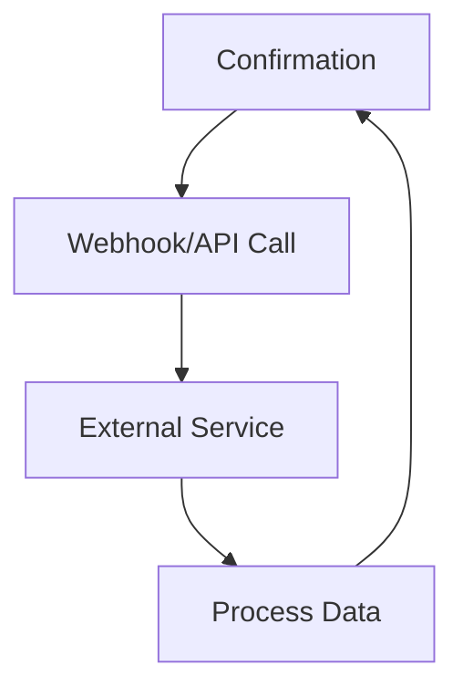

## Overview

Mar Key supports seamless integrations with popular third-party services, webhooks for real-time notifications, a robust API for custom workflows, and exports to common formats. You configure these features from your dashboard at `https://dashboard.example.com/integrations`. This guide walks you through each option to extend your documentation management.

<Callout kind="info">
  Enable integrations in your project settings first. Navigate to Project Settings {">"} Integrations.
</Callout>

## Third-Party App Connections

Connect Mar Key to tools like Slack, GitHub, and Zapier to automate updates and notifications.

<Columns cols={3}>
  <Card title="Slack" icon="message-circle" href="#">
    Send doc update notifications to your Slack channel.
  </Card>
  <Card title="GitHub" icon="github" href="#" target="_blank">
    Sync documentation changes with pull requests.
  </Card>
  <Card title="Zapier" icon="zap" href="#">
    Build no-code automations with 5000+ apps.
  </Card>
</Columns>

## Webhook Configuration

Set up webhooks to receive events like document updates or project changes. Post payloads to your endpoint at `https://your-webhook-url.com/webhook`.

<Steps>
  <Step title="Create Webhook" icon="plus">
    Go to Integrations {">"} Webhooks {">"} New Webhook. Enter your endpoint URL.
  </Step>
  <Step title="Select Events" icon="list">
    Choose events: `doc.updated`, `project.published`, `user.invited`.
  </Step>
  <Step title="Test and Save" icon="check-circle">
    Send a test event, then save.
  </Step>
</Steps>

Here is a sample webhook payload:

<CodeGroup tabs="JSON">
```json
{
  "event": "doc.updated",
  "project_id": "proj_123abc",
  "doc_id": "doc_456def",
  "timestamp": "2024-01-15T10:30:00Z",
  "user_id": "user_789ghi"
}
```
</CodeGroup>

## API Usage for Custom Integrations

Use the Mar Key API at `https://api.example.com/v1` to create, update, or fetch documentation programmatically. Authenticate with `Authorization: Bearer YOUR_API_KEY`.

<ParamField header="Authorization" param-type="string" required="true">
  Bearer token obtained from dashboard.
</ParamField>

<ParamField path="project_id" param-type="string" required="true">
  Your project identifier.
</ParamField>

<Tabs>
  <Tab title="JavaScript" icon="code">
    ```javascript
    const response = await fetch('https://api.example.com/v1/docs', {
      method: 'POST',
      headers: {
        'Authorization': 'Bearer YOUR_API_KEY',
        'Content-Type': 'application/json'
      },
      body: JSON.stringify({
        project_id: 'proj_123abc',
        title: 'New Doc',
        content: '# Hello World'
      })
    });
    const doc = await response.json();
    console.log(doc);
    ```
  </Tab>
  <Tab title="Python" icon="python">
````python
    import requests

    headers = {
        'Authorization': 'Bearer YOUR_API_KEY',
        'Content-Type': 'application/json'
    }
    data = {
        'project_id': 'proj_123abc',
        'title': 'New Doc',
        'content': '# Hello World'
    }
    response = requests.post('https://api.example.com/v1/docs', json=data, headers=headers)
    doc = response.json()
    print(doc)
````
  </Tab>
</Tabs>

<Request tabs="cURL,JavaScript">
````bash
curl -X POST https://api.example.com/v1/docs \
  -H "Authorization: Bearer YOUR_API_KEY" \
  -H "Content-Type: application/json" \
  -d '{
    "project_id": "proj_123abc",
    "title": "New Doc",
    "content": "# Hello World"
  }'
````

```javascript
const response = await fetch('https://api.example.com/v1/docs', {
  method: 'POST',
  headers: {
    'Authorization': 'Bearer YOUR_API_KEY',
    'Content-Type': 'application/json'
  },
  body: JSON.stringify({
    project_id: 'proj_123abc',
    title: 'New Doc',
    content: '# Hello World'
  })
});
```
</Request>

<Response tabs="200,400">
```json
{
  "id": "doc_456def",
  "title": "New Doc",
  "status": "success"
}
```

```json
{
  "error": "Invalid project_id",
  "status": "400 Bad Request"
}
```
</Response>

## Export to Popular Formats

Export your documentation to share or archive in various formats.

<Tabs>
  <Tab title="PDF" icon="file-text">
    Select Docs {">"} Export {">"} PDF. Includes table of contents and images.
  </Tab>
  <Tab title="Markdown" icon="markdown">
    Exports clean MDX source. Ideal for GitHub repos.
  </Tab>
  <Tab title="HTML" icon="globe">
    Single-page or multi-page static site.
  </Tab>
</Tabs>

<Expandable title="Advanced Export Options">
  Use query params for custom exports: `?format=pdf&theme=dark&include=images,toc`.
</Expandable>

## Integration Flow



<Callout kind="tip">
  Monitor integration logs in your dashboard for troubleshooting. Start with webhooks for simple automations.
</Callout>